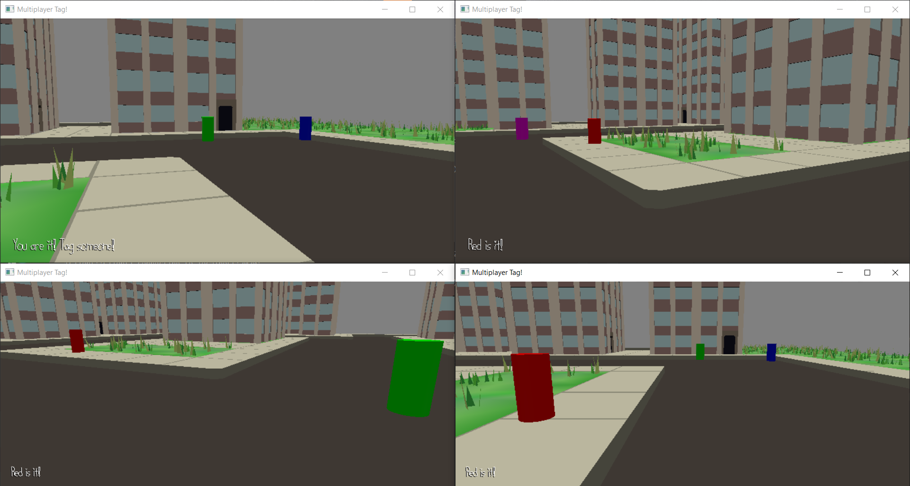

# Multiplayer Tag

Author: Tyler Thompson

Design: This is a networked game of tag in which the player who is it can run faster so as to better enourage over-turn as it pertains to who is it. To balance out the speed increase, players cannot move for the first few seconds after being tagged.

Networking: I trasmit code between server.cpp and PlayMode.cpp. When a player connects, I transmit which player they are from the server to the player. This is used to determine which camera/cylinder the player takes control of. This is transmitted through a string. In game, each client transmits it's associated camera's position to the server (done in PlayMode.cpp). The server then sends all client positions to all clients. Clients then use this to update the positions of the cameras/cylinders associated with the other clients. The transforms are transmitted as a group of 9 uint8_t per transform. This uint8_t are the sign of the transform, the digits to the left of the decimal point, and the first 2 digits to the right of the decimal point, all for the position's x, y, and z. The server is always transmitting who is "it". This is transmitted through a string. When a new person is tagged, the old "it" client lets the server know who the new "it" client is (done in PlayMode.cpp). This is transmitted as a uint8_t. Since the server is always transmitting who is "it", the other clients are quickly updated by the server.

Screen Shot:

How To Play: Move with the WASD keys and look with the camera. When it, tag other players by running into them.

Sources:
My Makefile originally came from Dominic Calkosz, who shared it in the class Discord.
I recycled code from base code 2 and base code 3, and from my additions to base code 2 and base code 3.
This recycled code included functions for converting between quaternions and Euler angles from Wikipedia. This is called out in the comments in-code with links to the Wikipedia article.
I reused my scene that I made for game 2.
All other code help is called out in the comments in-code.

This game was built with [NEST](NEST.md).

KNOWN ISSUES:
Currently problems can arise when a new client tries to join after and old one has left. For example, if over the couse of the server's lifetime there are four clients, none of which leave until all are connected, then the game works fine. However, if the fourth client tried to join after the first client left, they will successfully join, but there may be weird behavior.
